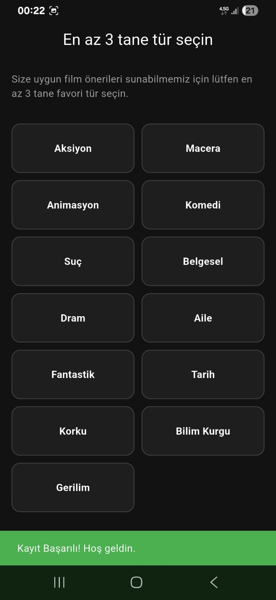
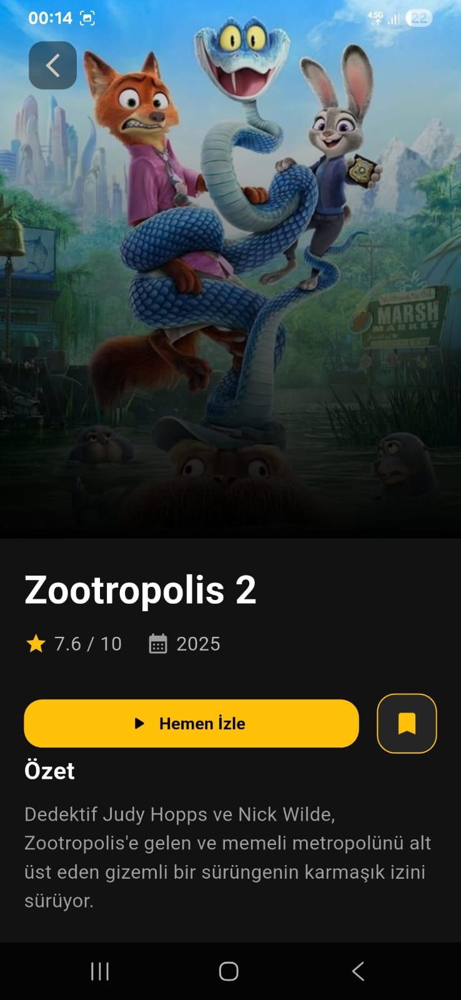
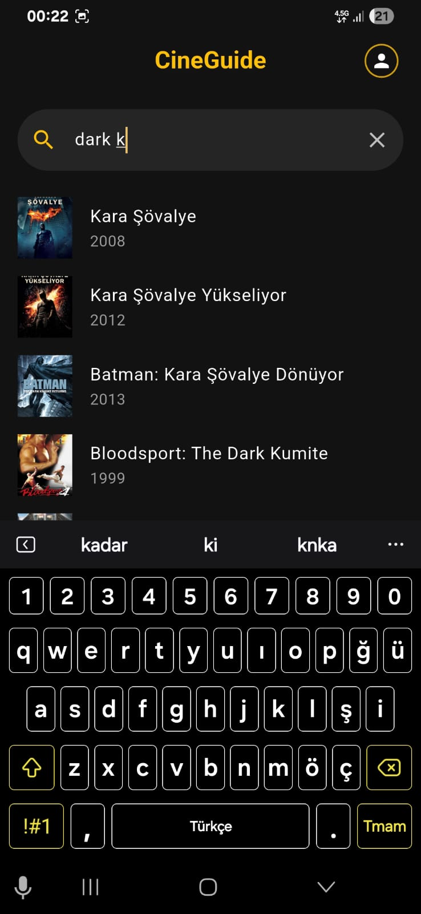
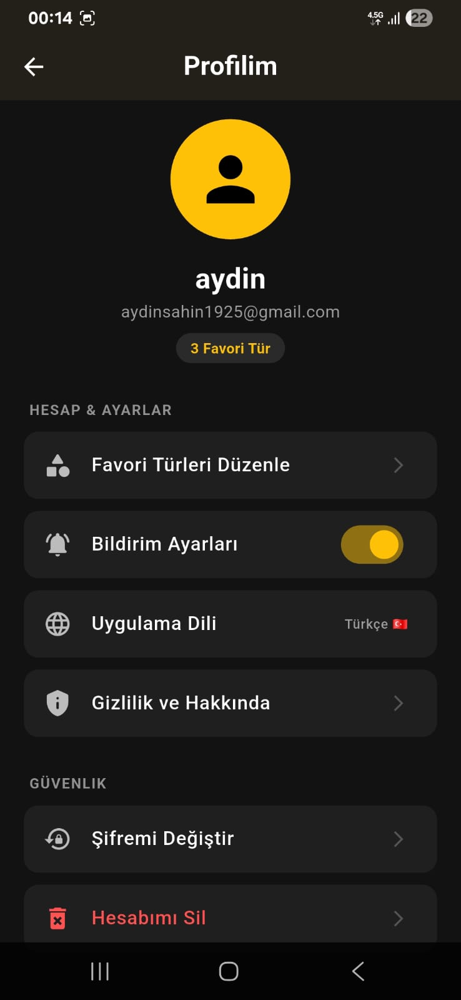

# 🎬 CineGuide: Kişisel Film Asistanınız


---

## 🚀 Proje Hakkında & Vizyon

**CineGuide**, başlangıçta **üniversite müfredatı kapsamında akademik bir ders projesi** olarak geliştirilmeye başlanmış, ancak geliştirme sürecinde ulaşılan mimari olgunluk ve potansiyel ile **ticari bir ürüne evrilme sürecine girmiş** modern bir mobil uygulamadır.

Bu proje, standart bir ders ödevinin ötesine geçerek; kullanıcı davranışlarını analiz eden, **kişiselleştirilmiş algoritmalarla** öneriler sunan ve bulut tabanlı senkronizasyon sağlayan ölçeklenebilir bir **MVP (Minimum Viable Product)** örneğidir.

Amacımız: Karmaşık film kütüphaneleri arasında kaybolan kullanıcıya, "Ne izlesem?" sorusunun cevabını en hızlı ve en isabetli şekilde vermektir.

---

## 📱 Uygulama İçi Görseller

<p align="center">
  
  
  
  
</p>

---

## 🌟 Temel Özellikler

### 👤 Kullanıcı Deneyimi (UX) & Kişiselleştirme
* **Akıllı Onboarding:** Kayıt esnasında kullanıcının sevdiği türlerin (Aksiyon, Drama vb.) analiz edilmesi.
* **Dinamik Ana Sayfa:** Kullanıcının tercihlerine göre anlık olarak yeniden şekillenen API destekli akış.
* **Canlı Arama (Live Search):** `Debounce` mekanizması ile optimize edilmiş, her tuş vuruşunda tetiklenen performanslı arama motoru.

### ⚙️ Teknik Yetenekler & Backend
* **Supabase Auth Entegrasyonu:** Güvenli oturum yönetimi, "Beni Hatırla" özelliği ve kullanıcı verilerinin şifreli saklanması.
* **Gerçek Zamanlı Veritabanı:** Favorilere eklenen filmlerin anlık olarak bulut sunucuyla (Supabase PostgreSQL) senkronize edilmesi.
* **Lazy Loading Mimarisi:** İzleme listesindeki filmlerin detay verilerinin, sadece tıklandığında API'den çekilerek (On-Demand Fetch) veri tasarrufu sağlanması.
* **Validasyonlu Form Yapıları:** Profil güncellemelerinde hatalı girişleri engelleyen dinamik kontrol mekanizmaları.

---

## 🛠 Teknoloji Yığını (Tech Stack)

| Alan | Teknoloji | Açıklama |
|---|---|---|
| **Mobil Framework** | Flutter (Dart) | Cross-platform geliştirme |
| **Backend & Auth** | Supabase | Authentication ve Veritabanı |
| **Veri Sağlayıcı** | TMDB API | Film dataları ve görselleri |
| **Mimari** | MVC Pattern | Modüler ve temiz kod yapısı |
| **HTTP İstekleri** | http paketi | REST API iletişimi |

---

## 🏗 Kurulum ve Çalıştırma

Bu proje açık kaynaklıdır ve geliştirilmeye açıktır. Lokalde çalıştırmak için:

1.  **Projeyi Klonlayın**
    ```bash
    git clone [https://github.com/aydin1925/CineGuide.git](https://github.com/aydin1925/CineGuide.git)
    cd CineGuide
    ```

2.  **Bağımlılıkları Yükleyin**
    ```bash
    flutter pub get
    ```

3.  **Çevre Değişkenlerini (Environment) Ayarlayın**
    *Projenin çalışması için kendi API anahtarlarınızı girmeniz gerekmektedir.*
    * `lib/services/tmdb_services.dart` -> **TMDB API Key**
    * `lib/main.dart` -> **Supabase URL & Anon Key**

4.  **Uygulamayı Başlatın**
    ```bash
    flutter run
    ```

---

## 🗺 Yol Haritası (Roadmap)

Uygulamanın ticari sürüme geçişi ve bir sosyal platforma dönüşmesi için planlanan özellikler:

- [ ] **v1.1 (Profil & Kütüphane):**
    - [ ] Kullanıcı adı (Username) değiştirme özelliği.
    - [ ] **"İzledim" (Watched)** butonu ve profilde izlenenler listesi.
- [ ] **v1.2 (İçerik Genişletme):**
    - [ ] Ana sayfada **Diziler (TV Series)** ve Filmler olarak kategorik ayrım.
    - [ ] **Fragman Entegrasyonu:** Detay sayfasında YouTube API ile fragman oynatma.
- [ ] **v1.3 (Sosyal & Medya):**
    - [ ] Profil fotoğrafı (Avatar) yükleme ve düzenleme.
    - [ ] Filmlere **Kişisel Notlar** ekleme (Public/Private seçeneği ile).
- [ ] **v2.0 (Yönetim Paneli):**
    - [ ] Özel yetkili **Admin Girişi**.
    - [ ] Admin Dashboard üzerinden kullanıcı, içerik ve yorum yönetimi.

---

## ⚠️ Yasal Uyarı

*Bu uygulama film verileri için [TMDB (The Movie Database)](https://www.themoviedb.org/) API'sini kullanmaktadır. Bu proje TMDB tarafından onaylanmamış veya sertifikalandırılmamıştır.*

---

### 👨‍💻 Geliştirici

Bu proje **Aydın ŞAHİN** tarafından geliştirilmektedir.

[](https://linkedin.com/in/aydinsahin1925)
[](https://github.com/aydin1925) 
